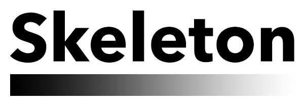

<p align="center">
    
</p>


<p align="center">
    <a href="https://developer.apple.com/swift">
        
    </a>
    <a href="https://cocoapods.org/pods/Skeleton">
        
    </a>
    <a href="https://github.com/Carthage/Carthage">
        
    </a>
    <a href="https://opensource.org/licenses/MIT">
        
    </a>
    <a href="http://www.gonzalonunez.me/Skeleton/">
        
    </a>
</p>

Skeleton is an easy way to create sliding `CAGradientLayer` animations! It works great for creating skeleton screens:


## 👩‍💻 Usage

The entire library comes down to just one public-facing extension:

```swift
public extension CAGradientLayer {
  public func slide(to dir: Direction, group: ((CAAnimationGroup) -> Void) = { _ in })
  public func stopSliding()
}
```

You can check out the example and the [documentation](http://www.gonzalonunez.me/Skeleton/) for more.

## 📚 Example

To run the example project, clone the repo, and run `pod install` from the Example directory first.

## 🛠 Installation

Skeleton is available through [CocoaPods](http://cocoapods.org). To install it, simply add the following line to your Podfile:

```ruby
pod "Skeleton"
```

Skeleton is also available through [Carthage](https://github.com/Carthage/Carthage). Add this to your Cartfile:

```
github "gonzalonunez/Skeleton" ~> 0.4.1
```

## 📄 License

Skeleton is available under the MIT license. See the LICENSE file for more info.
